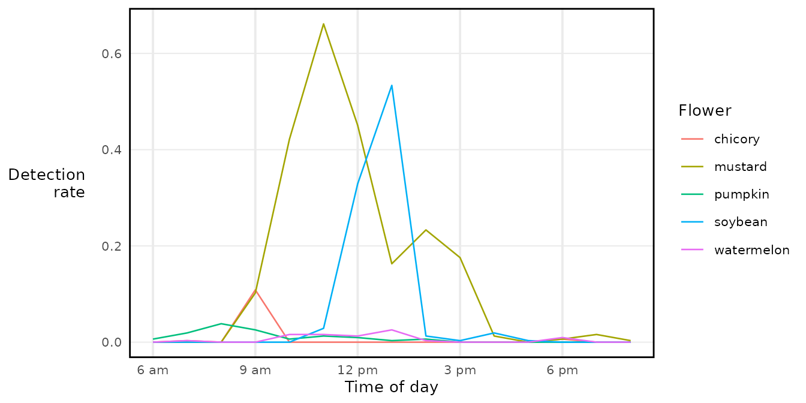

# Interpreting time in buzzr

buzzr works with two different representations of time:

- **File-time** (`start_filetime`): seconds elapsed since the start of
  the audio file. This is what buzzdetect writes directly — it knows
  nothing about when you pressed record.
- **Date-time** (`start_datetime`): an absolute timestamp, like
  `2023-08-09 06:00:00`. To get this, buzzr needs to know when the
  recording started, which it reads from the file name.

This vignette explains how buzzr converts file names into date-times,
how to handle mixed recorder types, and how to work with the resulting
timestamps for plotting and modelling.

------------------------------------------------------------------------

## Reading a timestamp from a file name

Most field recorders embed the recording start time in the file name.
buzzr reads this using the same POSIX format codes as base R’s
[`strptime()`](https://rdrr.io/r/base/strptime.html). Common examples:

| File name pattern                   | Format string         |
|-------------------------------------|-----------------------|
| `230809_0600` (YYMMDD_HHMM)         | `'%y%m%d_%H%M'`       |
| `20230809_000000` (YYYYMMDD_HHMMSS) | `'%Y%m%d_%H%M%S'`     |
| `2023-08-09_00-00-00`               | `'%Y-%m-%d_%H-%M-%S'` |

The Five Flowers dataset uses the `YYMMDD_HHMM` pattern. Let’s parse a
single file:

``` r
path <- system.file(
  'extdata/five_flowers_snip/soybean/53/230809_0600_buzzdetect.csv',
  package = 'buzzr'
)

# Without posix_formats: time stays as file-time (seconds from file start)
head(read_results(path), 3)
#>    start_filetime activation_ins_trill activation_mech_plane
#>             <num>                <num>                 <num>
#> 1:           0.00                 -2.8                  -2.3
#> 2:           0.96                 -2.5                  -2.7
#> 3:           1.92                 -2.2                  -2.4
#>    activation_ambient_rain activation_ins_buzz
#>                      <num>               <num>
#> 1:                    -2.4                -2.2
#> 2:                    -2.5                -2.3
#> 3:                    -2.4                -2.4

# With posix_formats: file-time is converted to an absolute date-time
head(read_results(path, posix_formats = '%y%m%d_%H%M', tz = 'America/New_York'), 3)
#>         start_datetime activation_ins_trill activation_mech_plane
#>                 <POSc>                <num>                 <num>
#> 1: 2023-08-09 06:00:00                 -2.8                  -2.3
#> 2: 2023-08-09 06:00:00                 -2.5                  -2.7
#> 3: 2023-08-09 06:00:01                 -2.2                  -2.4
#>    activation_ambient_rain activation_ins_buzz
#>                      <num>               <num>
#> 1:                    -2.4                -2.2
#> 2:                    -2.5                -2.3
#> 3:                    -2.4                -2.4
```

The `_buzzdetect` suffix and file extension are stripped before
matching, so your format string only needs to describe the timestamp
part of the name.

You can also call
[`file_start_time()`](https://osu-bee-lab.github.io/buzzr/reference/file_start_time.md)
directly if you just want the recording’s start time without reading the
full file:

``` r
file_start_time(path, posix_formats = '%y%m%d_%H%M', tz = 'America/New_York')
#> [1] "2023-08-09 06:00:00 EDT"
```

It works on a vector of paths too:

``` r
dir <- system.file('extdata/five_flowers_snip', package = 'buzzr')
paths <- list.files(dir, pattern = '_buzzdetect', recursive = TRUE, full.names = TRUE)

file_start_time(paths, posix_formats = '%y%m%d_%H%M', tz = 'America/New_York')
#>  [1] "2025-07-04 06:00:00 EDT" "2025-07-04 07:00:00 EDT"
#>  [3] "2025-07-04 08:00:00 EDT" "2025-07-04 09:00:00 EDT"
#>  [5] "2025-07-04 10:00:00 EDT" "2025-07-04 11:00:00 EDT"
#>  [7] "2025-07-04 12:00:00 EDT" "2025-07-04 13:00:00 EDT"
#>  [9] "2025-07-04 14:00:00 EDT" "2025-07-04 15:00:00 EDT"
#> [11] "2025-07-04 16:00:00 EDT" "2025-07-04 17:00:00 EDT"
#> [13] "2025-07-04 18:00:00 EDT" "2025-07-04 19:00:00 EDT"
#> [15] "2025-07-04 20:00:00 EDT" "2024-09-04 06:00:00 EDT"
#> [17] "2024-09-04 07:00:00 EDT" "2024-09-04 08:00:00 EDT"
#> [19] "2024-09-04 09:00:00 EDT" "2024-09-04 10:00:00 EDT"
#> [21] "2024-09-04 11:00:00 EDT" "2024-09-04 12:00:00 EDT"
#> [23] "2024-09-04 13:00:00 EDT" "2024-09-04 14:00:00 EDT"
#> [25] "2024-09-04 15:00:00 EDT" "2024-09-04 16:00:00 EDT"
#> [27] "2024-09-04 17:00:00 EDT" "2024-09-04 18:00:00 EDT"
#> [29] "2024-09-04 19:00:00 EDT" "2024-09-04 20:00:00 EDT"
#> [31] "2024-08-08 06:00:00 EDT" "2024-08-08 07:00:00 EDT"
#> [33] "2024-08-08 08:00:00 EDT" "2024-08-08 09:00:00 EDT"
#> [35] "2024-08-08 10:00:00 EDT" "2024-08-08 11:00:00 EDT"
#> [37] "2024-08-08 12:00:00 EDT" "2024-08-08 13:00:00 EDT"
#> [39] "2024-08-08 14:00:00 EDT" "2024-08-08 15:00:00 EDT"
#> [41] "2024-08-08 16:00:00 EDT" "2024-08-08 17:00:00 EDT"
#> [43] "2024-08-08 18:00:00 EDT" "2024-08-08 19:00:00 EDT"
#> [45] "2024-08-08 20:00:00 EDT" "2023-08-09 06:00:00 EDT"
#> [47] "2023-08-09 07:00:00 EDT" "2023-08-09 08:00:00 EDT"
#> [49] "2023-08-09 09:00:00 EDT" "2023-08-09 10:00:00 EDT"
#> [51] "2023-08-09 11:00:00 EDT" "2023-08-09 12:00:00 EDT"
#> [53] "2023-08-09 13:00:00 EDT" "2023-08-09 14:00:00 EDT"
#> [55] "2023-08-09 15:00:00 EDT" "2023-08-09 16:00:00 EDT"
#> [57] "2023-08-09 17:00:00 EDT" "2023-08-09 18:00:00 EDT"
#> [59] "2023-08-09 19:00:00 EDT" "2023-08-09 20:00:00 EDT"
#> [61] "2024-07-27 06:00:00 EDT" "2024-07-27 07:00:00 EDT"
#> [63] "2024-07-27 08:00:00 EDT" "2024-07-27 09:00:00 EDT"
#> [65] "2024-07-27 10:00:00 EDT" "2024-07-27 11:00:00 EDT"
#> [67] "2024-07-27 12:00:00 EDT" "2024-07-27 13:00:00 EDT"
#> [69] "2024-07-27 14:00:00 EDT" "2024-07-27 15:00:00 EDT"
#> [71] "2024-07-27 16:00:00 EDT" "2024-07-27 17:00:00 EDT"
#> [73] "2024-07-27 18:00:00 EDT" "2024-07-27 19:00:00 EDT"
#> [75] "2024-07-27 20:00:00 EDT"
```

------------------------------------------------------------------------

## Time zones

Always pass a `tz` argument. If you omit it, R uses your system time
zone, which will silently produce wrong results if you analyse data
collected in a different zone.

``` r
# Same file, two different time zones — note the hour difference
file_start_time(path, posix_formats = '%y%m%d_%H%M', tz = 'America/New_York')
#> [1] "2023-08-09 06:00:00 EDT"
file_start_time(path, posix_formats = '%y%m%d_%H%M', tz = 'America/Chicago')
#> [1] "2023-08-09 06:00:00 CDT"
```

Use [`OlsonNames()`](https://rdrr.io/r/base/timezones.html) to browse
valid time zone strings.

------------------------------------------------------------------------

## Keeping both time columns

By default, `start_filetime` is dropped once `start_datetime` is added.
Set `drop_filetime = FALSE` to keep both:

``` r
head(
  read_results(
    path,
    posix_formats = '%y%m%d_%H%M',
    tz = 'America/New_York',
    drop_filetime = FALSE
  ),
  3
)
#>         start_datetime start_filetime activation_ins_trill
#>                 <POSc>          <num>                <num>
#> 1: 2023-08-09 06:00:00           0.00                 -2.8
#> 2: 2023-08-09 06:00:00           0.96                 -2.5
#> 3: 2023-08-09 06:00:01           1.92                 -2.2
#>    activation_mech_plane activation_ambient_rain activation_ins_buzz
#>                    <num>                   <num>               <num>
#> 1:                  -2.3                    -2.4                -2.2
#> 2:                  -2.7                    -2.5                -2.3
#> 3:                  -2.4                    -2.4                -2.4
```

File-time is useful if you want to extract audio clips later (e.g. using
FFmpeg to cut from a specific second in the source file).

------------------------------------------------------------------------

## Mixed recorder types: multiple format strings

If your experiment used more than one recorder model, the file names may
follow different timestamp conventions. Supply all formats as a
character vector:

``` r
# Imagine two recorder types in the same experiment:
#   AudioMoth:  YYYYMMDD_HHMMSS  e.g. 20230809_060000_buzzdetect.csv
#   SongMeter:  YYMMDD_HHMM      e.g. 230809_0600_buzzdetect.csv

paths_mixed <- c(
  'site_a/audiomoth/20230809_060000_buzzdetect.csv',  # AudioMoth
  'site_b/songmeter/230809_0600_buzzdetect.csv'       # SongMeter
)

formats_mixed <- c('%Y%m%d_%H%M%S', '%y%m%d_%H%M')
```

When each file matches exactly one format, everything resolves cleanly:

``` r
file_start_time(paths_mixed, posix_formats = formats_mixed, tz = 'America/New_York')
#> [1] "2023-08-09 06:00:00 EDT" "2023-08-09 06:00:00 EDT"
```

### When a file matches two formats with different results

This is where things get tricky. A SongMeter file like `230809_0600`
will match `%y%m%d_%H%M` (→ 2023) but it can also match `%Y%m%d_%H%M%S`
if interpreted as year 0230 (an implausible date, but R won’t reject
it). More dangerously, `20230809_060000` matches `%Y%m%d_%H%M%S` (→
2023-08-09 06:00:00) but also `%y%m%d_%H%M` (→ year 2020, completely
wrong).

By default (`first_match = FALSE`), buzzr returns `NA` and warns you
when formats conflict:

``` r
# Construct a path that matches both formats ambiguously
ambiguous_path <- 'site/recorder/20230809_060000_buzzdetect.csv'

file_start_time(
  ambiguous_path,
  posix_formats = c('%Y%m%d_%H%M%S', '%y%m%d_%H%M'),
  tz = 'America/New_York',
  first_match = FALSE
)
#> [1] "2023-08-09 06:00:00 EDT"
```

If you know which format should take priority, set `first_match = TRUE`
to accept the first matching format and move on:

``` r
# With '%Y%m%d_%H%M%S' listed first, the four-digit-year parse wins
file_start_time(
  ambiguous_path,
  posix_formats = c('%Y%m%d_%H%M%S', '%y%m%d_%H%M'),
  tz = 'America/New_York',
  first_match = TRUE
)
#> [1] "2023-08-09 06:00:00 EDT"

# Swap the order — now the two-digit-year parse wins (wrong!)
file_start_time(
  ambiguous_path,
  posix_formats = c('%y%m%d_%H%M', '%Y%m%d_%H%M%S'),
  tz = 'America/New_York',
  first_match = TRUE
)
#> [1] "2023-08-09 06:00:00 EDT"
```

The order of `posix_formats` matters when `first_match = TRUE`. Put the
most specific (or most trusted) format first.

### When a file matches two formats with the *same* result

If two formats resolve to identical timestamps, buzzr silently
deduplicates them — no warning, no NA:

``` r
# These two formats both parse '230809_0600' as 2023-08-09 06:00:00
# (one by coincidence of the numeric overlap)
file_start_time(
  'site/recorder/230809_0600_buzzdetect.csv',
  posix_formats = c('%y%m%d_%H%M', '%y%m%d_%H%M'),  # duplicate format
  tz = 'America/New_York'
)
#> [1] "2023-08-09 06:00:00 EDT"
```

### If no format matches

buzzr returns `NA` with a warning, so downstream code doesn’t fail
silently:

``` r
file_start_time(
  'site/recorder/no_timestamp_here_buzzdetect.csv',
  posix_formats = '%y%m%d_%H%M',
  tz = 'America/New_York'
)
#> Warning: Returning NA for start time of file
#> 'site/recorder/no_timestamp_here_buzzdetect.csv'. No POSIX matches found.
#> [1] NA
```

------------------------------------------------------------------------

## Plotting time of day: `commontime()`

When recordings span multiple calendar days you can’t overlay them
directly on a datetime axis — the dates differ even if the time of day
is the same.
[`commontime()`](https://osu-bee-lab.github.io/buzzr/reference/commontime.md)
solves this by setting every date to the same arbitrary day (2000-01-01)
while preserving the time of day:

``` r
dir <- system.file('extdata/five_flowers_snip', package = 'buzzr')

binned <- bin_directory(
  dir_results   = dir,
  thresholds    = c(ins_buzz = -1.2),
  posix_formats = '%y%m%d_%H%M',
  tz            = 'America/New_York',
  dir_nesting   = c('flower', 'recorder'),
  binwidth       = 20,
  calculate_rate = TRUE
)
#> Grouping time bins using columns: flower, recorder

# Dates vary across the five recordings; commontime collapses them
range(binned$bin_datetime)
#> [1] "2023-08-09 06:00:00 EDT" "2025-07-04 20:00:00 EDT"

binned$time_of_day <- commontime(binned$bin_datetime, tz = 'America/New_York')
range(binned$time_of_day)
#> [1] "2000-01-01 06:00:00 EST" "2000-01-01 20:00:00 EST"
```

Now all five flowers share the same x axis, regardless of which day they
were recorded:

``` r
library(ggplot2)

ggplot(binned, aes(x = time_of_day, y = detectionrate_ins_buzz, color = flower)) +
  geom_line() +
  scale_x_datetime(labels = label_hour(tz = 'America/New_York')) +
  labs(x = 'Time of day', y = 'Detection\nrate', color = 'Flower') +
  theme_buzzr()
```



Always pass the **same `tz`** to
[`commontime()`](https://osu-bee-lab.github.io/buzzr/reference/commontime.md)
and
[`label_hour()`](https://osu-bee-lab.github.io/buzzr/reference/label_hour.md).
If they differ, the axis labels won’t match the data.

------------------------------------------------------------------------

## Numeric time of day: `time_of_day()`

For statistical modelling — circular regression, GAMs, peak-time
estimates — it’s more convenient to have time as a number.
[`time_of_day()`](https://osu-bee-lab.github.io/buzzr/reference/time_of_day.md)
returns either a proportion of the 24-hour day or a decimal hour:

``` r
times <- as.POSIXct(
  c('2023-08-09 00:00:00', '2023-08-09 06:00:00',
    '2023-08-09 12:00:00', '2023-08-09 18:30:00'),
  tz = 'America/New_York'
)

# Proportion: midnight = 0, noon = 0.5, next midnight = 1
time_of_day(times)
#> [1] 0.0000000 0.2500000 0.5000000 0.7708333

# Decimal hours: midnight = 0, 6 AM = 6, 6:30 PM = 18.5
time_of_day(times, time_format = 'hour')
#> [1]  0.0  6.0 12.0 18.5
```

Unlike
[`commontime()`](https://osu-bee-lab.github.io/buzzr/reference/commontime.md),
this strips the date entirely and returns a plain number, which is
easier to pass to modelling functions:

``` r
binned$hour <- time_of_day(binned$bin_datetime, time_format = 'hour')

# e.g. find the hour of peak detections for each flower
binned[, .SD[which.max(detectionrate_ins_buzz)][, .(peak_hour = hour)],
       by = flower]
#>        flower peak_hour
#>        <char>     <num>
#> 1:    chicory         9
#> 2:    mustard        11
#> 3:    pumpkin         8
#> 4:    soybean        13
#> 5: watermelon        13
```
